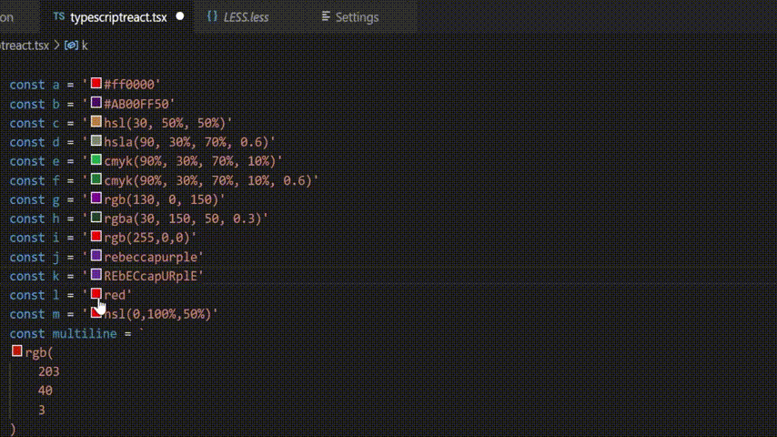
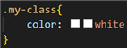

# 🌌 Color Picker Universal 🌌

## 🌐 Links

[Website](https://jeronimoek.github.io/color-translate-web/)

[Visual Studio Marketplace](https://marketplace.visualstudio.com/items?itemName=JeronimoEkerdt.color-picker-universal)

[Open VSX Registry](https://open-vsx.org/extension/JeronimoEkerdt/color-picker-universal)

[Github Repository](https://github.com/jeronimoek/color-picker-universal)

## ✅ Features

Pick and translate between multiple color formats, in any file.

Formats supported: rgb/a, hex/a, hsl/a, hwb/a, cmyk/a, hex 0x, lab, lch, oklab, oklch, a98-rgb and named colors.

This extension can be used through its color pickers, commands, or context menu options.

## ⚙ Settings

To see settings press `CTRL + ,` OR `⌘ + ,`

| Id                                        | Description                                                   | Default | Available values                                                                                            | Example                                  |
| ----------------------------------------- | ------------------------------------------------------------- | ------- | ----------------------------------------------------------------------------------------------------------- | ---------------------------------------- |
| color-picker-universal.disable            | Disables the extension                                        | false   | true false                                                                                                  | true                                     |
| color-picker-universal.ignoreVariableName | If enabled, ignores colors in variables names                 | true    | true false                                                                                                  | false                                    |
| color-picker-universal.preferLegacy       | If enabled, colors are displayed in legacy mode when possible | false   | true false                                                                                                  | true                                     |
| color-picker-universal.languages          | Enabled language identifiers. Use "!" to exclude languages    | ["*"]   | [Default identifiers](https://code.visualstudio.com/docs/languages/identifiers#_known-language-identifiers) | ["*", "!css", "!less", "!sass", "!scss"] |
| color-picker-universal.formatsFrom        | Enabled formats to translate from. Use "!" to exclude formats | ["*"]   | "\*" "device-cmyk" "hex" "hsl" "hwb" "named" "rgb" "hex0x" "lab" "lch" "oklab" "oklch"                      | ["*", "!hex_0x", "!named"]               |
| color-picker-universal.formatsTo          | Enabled formats to translate into. Use "!" to exclude formats | ["*"]   | "\*" "cmyk" "hex" "hsl" "hwb" "named" "rgb" "hex0x" "lab" "lch" "oklab" "oklch"                             | ["*", "!hex_0x", "!cmyk", "!hwb"]        |

## ✍ Commands

To see commands press `F1` and type `Color Picker Universal`

[//]: # "vscode-table-commands(title:Name|command:Command)"

| Name                               | Command                                |
| ---------------------------------- | -------------------------------------- |
| Translate colors to another format | color-picker-universal.translateColors |

## 🗨 Editor's context menu options

To see the editor's context menu options press `right click` inside a file content's editor

[//]: # "vscode-table-menus(title:Name|command:Command)"

| Name                               | Command                                |
| ---------------------------------- | -------------------------------------- |
| Translate colors to another format | color-picker-universal.translateColors |

## 🐞 Known Issues

[#68](https://github.com/jeronimoek/color-picker-universal/issues/68) When working with **css**, **less**, **sass** and **scss** files, the color picker is duplicated due to the default Vscode color picker. Currently the only workaround is excluding these file extensions in the `color-picker-universal.languages` setting (see example value above)

