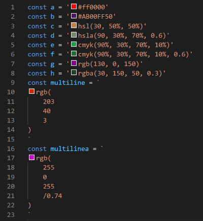

# 🌌 Color Picker Universal 🌌

## **_Features_**

Pick and translate between multiple color formats, in any file.

Formats supported: rgb/a, hex/a, hsl/a, hwb/a, cmyk/a, and named colors.

This extension can be used through it's color pickers, commands, or context menu options.

## **_Settings_**

To see settings press `CTRL + ,` OR `⌘ + ,`

| Id                                 | Description                                                | Default | Available values                                                                                            | Example                                   |
| ---------------------------------- | ---------------------------------------------------------- | ------- | ----------------------------------------------------------------------------------------------------------- | ----------------------------------------- |
| color-picker-universal.enable      | Controls if plugin is enabled                              | true    | true false                                                                                                  | true                                      |
| color-picker-universal.languages   | Enabled language identifiers. Use "!" to exclude languages | ["\*"]  | [Default identifiers](https://code.visualstudio.com/docs/languages/identifiers#_known-language-identifiers) | ["\*", "!css", "!less", "!sass", "!scss"] |
| color-picker-universal.formatsFrom | Enabled formats to translate from                          | ["\*"]  | "\*" "cmyk" "hex" "hsl" "named" "rgb" "hwb"                                                                 | ["rgb", "hex"]                            |
| color-picker-universal.formatsTo   | Enabled formats to translate into                          | ["\*"]  | "\*" "cmyk" "hex" "hsl" "named" "rgb" "hwb"                                                                 | ["rgb", "hex"]                            |

## **_Commands_**

To see commands press `F1` and type `Color Picker Universal`

| Name                               | Description                |
| ---------------------------------- | -------------------------- |
| Translate colors to another format | Multiple color translation |

## **_Editor's context menu options_**

To see the editor's context menu options press `right click` inside a file content's editor

| Name                               | Description                |
| ---------------------------------- | -------------------------- |
| Translate colors to another format | Multiple color translation |

## **_Known Issues_**

When working with **css**, **less**, **sass** and **scss** files, the color pickers get duplicated due to the default vscode color picker. Currently the only workaround is excluding these file extensions in the `color-picker-universal.languages` setting (see example value above)

See https://github.com/microsoft/vscode/issues/144036
